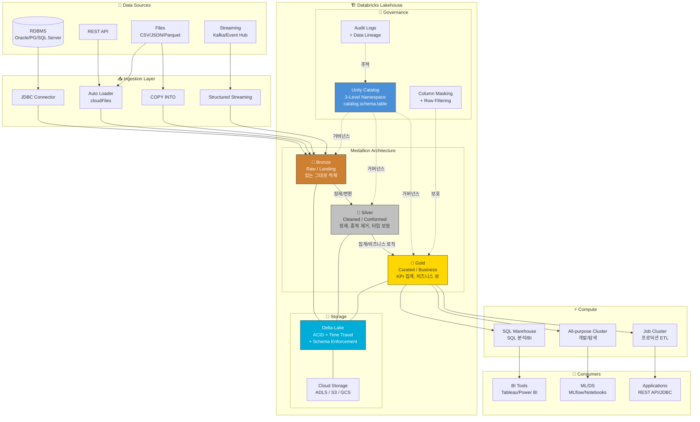
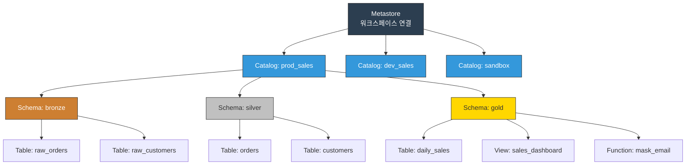
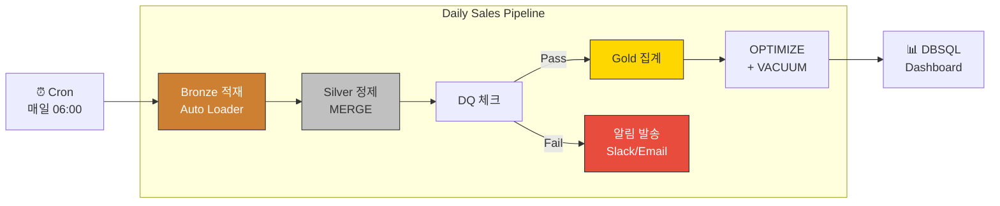

# 🏗️ Lakehouse 아키텍처 다이어그램

## 전체 데이터 흐름

```mermaid
graph TB
    subgraph Sources["📡 Data Sources"]
        DB[(RDBMS<br>Oracle/PG/SQL Server)]
        API[REST API]
        Files[Files<br>CSV/JSON/Parquet]
        Stream[Streaming<br>Kafka/Event Hub]
    end

    subgraph Ingestion["📥 Ingestion Layer"]
        AL[Auto Loader<br>cloudFiles]
        CI[COPY INTO]
        JDBC[JDBC Connector]
        SS[Structured Streaming]
    end

    subgraph Lakehouse["🏗️ Databricks Lakehouse"]
        subgraph Medallion["Medallion Architecture"]
            B[🥉 Bronze<br>Raw / Landing<br>있는 그대로 적재]
            S[🥈 Silver<br>Cleaned / Conformed<br>정제, 중복 제거, 타입 보정]
            G[🥇 Gold<br>Curated / Business<br>KPI 집계, 비즈니스 뷰]
        end

        subgraph Storage["💾 Storage"]
            Delta[Delta Lake<br>ACID + Time Travel<br>+ Schema Enforcement]
            Cloud[Cloud Storage<br>ADLS / S3 / GCS]
        end

        subgraph Governance["🔐 Governance"]
            UC[Unity Catalog<br>3-Level Namespace<br>catalog.schema.table]
            Mask[Column Masking<br>+ Row Filtering]
            Audit[Audit Logs<br>+ Data Lineage]
        end
    end

    subgraph Compute["⚡ Compute"]
        Cluster[All-purpose Cluster<br>개발/탐색]
        JobCluster[Job Cluster<br>프로덕션 ETL]
        SQLWH[SQL Warehouse<br>SQL 분석/BI]
    end

    subgraph Consumers["👥 Consumers"]
        BI[BI Tools<br>Tableau/Power BI]
        ML[ML/DS<br>MLflow/Notebooks]
        APP[Applications<br>REST API/JDBC]
    end

    DB --> JDBC
    API --> AL
    Files --> AL
    Files --> CI
    Stream --> SS

    JDBC --> B
    AL --> B
    CI --> B
    SS --> B

    B -->|정제/변환| S
    S -->|집계/비즈니스 로직| G

    B --- Delta
    S --- Delta
    G --- Delta
    Delta --- Cloud

    UC -.->|거버넌스| B
    UC -.->|거버넌스| S
    UC -.->|거버넌스| G
    Mask -.->|보호| G
    Audit -.->|추적| UC

    G --> SQLWH
    G --> Cluster
    G --> JobCluster

    SQLWH --> BI
    Cluster --> ML
    JobCluster --> APP

    style B fill:#cd7f32,stroke:#333,color:#fff
    style S fill:#c0c0c0,stroke:#333,color:#333
    style G fill:#ffd700,stroke:#333,color:#333
    style UC fill:#4a90d9,stroke:#333,color:#fff
    style Delta fill:#00add8,stroke:#333,color:#fff
```

## Unity Catalog 계층 구조

```mermaid
graph TB
    Meta[Metastore<br>워크스페이스 연결] --> Cat1[Catalog: prod_sales]
    Meta --> Cat2[Catalog: dev_sales]
    Meta --> Cat3[Catalog: sandbox]

    Cat1 --> S1[Schema: bronze]
    Cat1 --> S2[Schema: silver]
    Cat1 --> S3[Schema: gold]

    S1 --> T1[Table: raw_orders]
    S1 --> T2[Table: raw_customers]
    S2 --> T3[Table: orders]
    S2 --> T4[Table: customers]
    S3 --> T5[Table: daily_sales]
    S3 --> V1[View: sales_dashboard]
    S3 --> F1[Function: mask_email]

    style Meta fill:#2c3e50,stroke:#333,color:#fff
    style Cat1 fill:#3498db,stroke:#333,color:#fff
    style Cat2 fill:#3498db,stroke:#333,color:#fff
    style Cat3 fill:#3498db,stroke:#333,color:#fff
    style S1 fill:#cd7f32,stroke:#333,color:#fff
    style S2 fill:#c0c0c0,stroke:#333,color:#333
    style S3 fill:#ffd700,stroke:#333,color:#333
```

## Job / Workflow 실행 흐름

```mermaid
graph LR
    subgraph Job["Daily Sales Pipeline"]
        A[Bronze 적재<br>Auto Loader] --> B[Silver 정제<br>MERGE]
        B --> C[DQ 체크]
        C -->|Pass| D[Gold 집계]
        C -->|Fail| E[알림 발송<br>Slack/Email]
        D --> F[OPTIMIZE<br>+ VACUUM]
    end

    Trigger[⏰ Cron<br>매일 06:00] --> A
    F --> Dashboard[📊 DBSQL<br>Dashboard]

    style A fill:#cd7f32,stroke:#333,color:#fff
    style B fill:#c0c0c0,stroke:#333,color:#333
    style D fill:#ffd700,stroke:#333,color:#333
    style E fill:#e74c3c,stroke:#333,color:#fff
```
